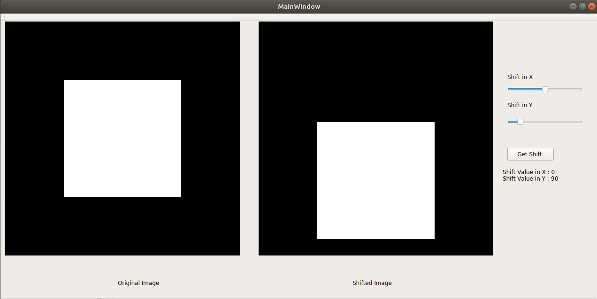

# DFT Shift 
Validation of shift property in discrete fourier transform using an original image and another one which is a shifted version of the original image. 

Getting the phase shift between both fourier transforms. 

## Requirements 

* Qt

## Build 

```bash
$ mkdir build
$ cd build
$ qmake .. 
$ make 
```
## Simple UI


